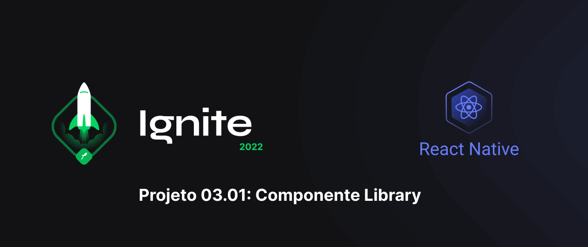
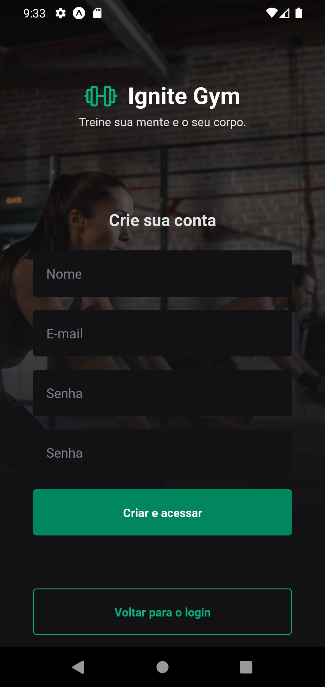
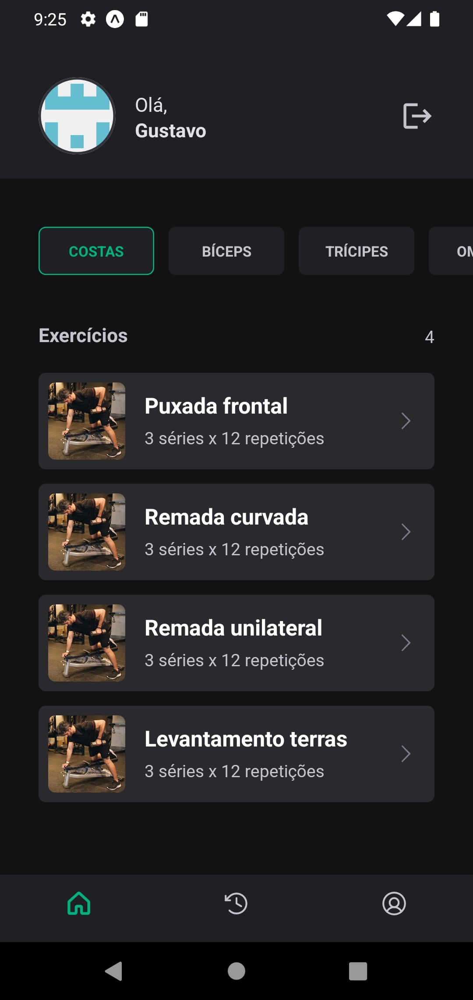
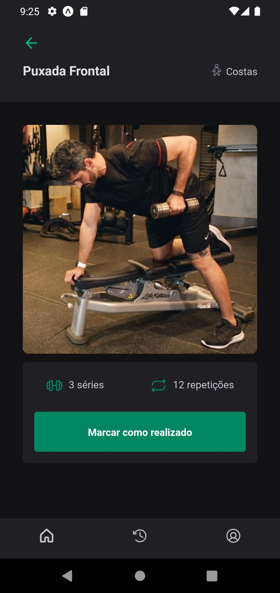
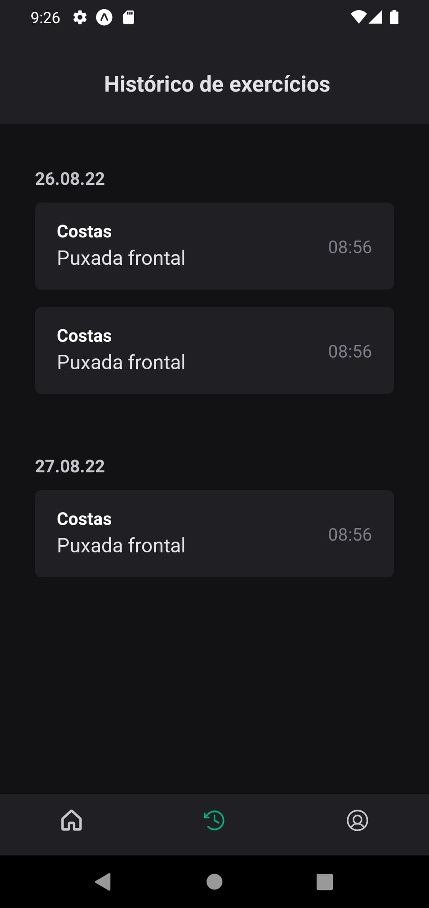
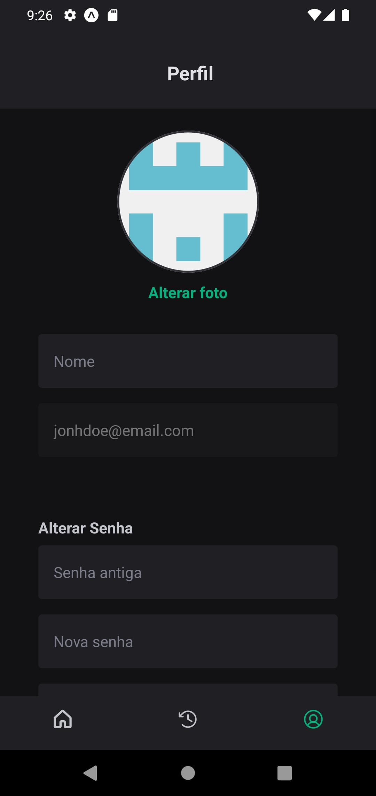

Esse repositório contém o 3° projeto: Component Library do curso de react native da rocketseat. Nesse módulo foi desenvolvido a estrutura visual da aplicação Ignite Gym, um aplicativo para controle de exercícios físicos.

<table>
  <tr>
    <td></td>
    <td></td>
    <td></td>
  </tr>
  <tr>
    <td></td>
    <td></td>
    <td></td>
  </tr>
</table>